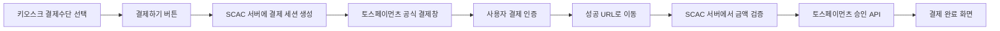
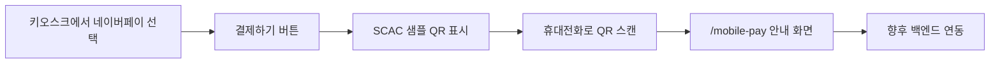

# SCAC 키오스크 간편결제 샘플 가이드

## 1. 문서 목적

이 문서는 `qr-payment-test` 프로젝트의 실행 방법과 결제 구조를 팀원에게 공유하기 위한 개발 가이드입니다.

이 프로젝트는 다음 두 가지 목적을 가지고 있습니다.

1. 키오스크에서 사용할 대형 간편결제 UI를 검증합니다.
2. 토스페이먼츠 API 개별 연동과 네이버페이 QR 방식의 향후 구조를 검증합니다.

현재 프로젝트는 운영용 완성본이 아닙니다. 토스페이와 카카오페이는 토스페이먼츠 SDK의 간편결제 자체창을 호출하고, 네이버페이는 향후 백엔드 연동을 위한 QR 화면까지만 구현되어 있습니다.

---

## 2. 현재 구현 범위

| 결제수단 | 현재 동작 | 실제 결제 요청 | 참고 |
| --- | --- | --- | --- |
| 토스페이 | 토스페이 공식 결제창 호출 | 테스트 키 설정 시 가능 | PC 결제창에서 공식 QR이 제공될 수 있음 |
| 네이버페이 | SCAC 샘플 QR 표시 | 아직 불가능 | 모바일 안내 페이지까지만 구현 |
| 카카오페이 | 카카오페이 공식 결제창 호출 | 계약된 테스트 키가 있을 때 가능 | 계약 상태에 따라 제한될 수 있음 |
| 계좌이체 | 화면과 서버 허용 목록에서 제외 | 불가능 | 키오스크 간편결제 범위에서 제외 |

테스트 키를 사용한 결제는 실제 금액이 출금되지 않습니다.

---

## 3. 사용자 화면 흐름

### 3.1 토스페이·카카오페이



### 3.2 네이버페이 QR 샘플



현재 네이버페이 QR에는 실제 결제정보가 아니라 SCAC 모바일 페이지 주소가 들어갑니다.

```text
http://키오스크주소:5173/mobile-pay
  ?sessionId=DEMO-...
  &method=naverpay
  &amount=1000
```

`sessionId`는 현재 프론트엔드에서 만드는 데모 값입니다. 운영 구현에서는 백엔드가 예측 불가능한 일회성 세션 ID를 발급해야 합니다.

---

## 4. 프로젝트 구조

```text
qr-payment-test/
├─ server/
│  └─ index.js             # 개발용 결제 세션 및 승인 서버
├─ src/
│  ├─ main.jsx             # 결제수단 선택, QR, 모바일·결과 화면
│  └─ styles.css           # 키오스크 및 모바일 반응형 스타일
├─ .env                    # 실제 로컬 환경변수, Git 제외
├─ .env.example            # 환경변수 예시
├─ .gitignore
├─ index.html
├─ package.json
├─ vite.config.js          # Vite 및 /api 프록시 설정
├─ README.md               # 간단한 실행 안내
└─ GUIDE.md                # 팀 배포용 상세 가이드
```

### `src/main.jsx`

하나의 React 진입점에서 URL 경로에 따라 화면을 구분합니다.

| 경로 | 화면 |
| --- | --- |
| `/` | 키오스크 결제수단 선택 화면 |
| `/mobile-pay` | 네이버페이 QR 스캔 후 표시되는 모바일 샘플 화면 |
| `/success` | 결제 인증 성공 후 서버 승인 화면 |
| `/fail` | 결제 인증 실패 화면 |

### `server/index.js`

개발용 Express 서버이며 다음 API를 제공합니다.

| 메서드와 경로 | 역할 |
| --- | --- |
| `POST /api/sessions` | 주문번호와 결제 세션 생성 |
| `GET /api/sessions/:id` | 결제 세션 상태 조회 |
| `POST /api/sessions/:id/confirm` | 금액 검증 후 토스 결제 승인 |
| `POST /api/sessions/:id/fail` | 결제 실패 상태 저장 |

현재 결제 세션은 서버 메모리의 `Map`에 저장됩니다. 서버를 재시작하면 모든 세션이 사라지므로 운영 환경에서는 사용할 수 없습니다.

### `vite.config.js`

프론트엔드의 `/api` 요청을 개발용 Express 서버로 전달합니다.

```text
브라우저 /api/... → Vite 5173 → Express 4000
```

---

## 5. 환경 준비

### 5.1 요구사항

- Node.js 20 이상 권장
- npm
- 토스페이먼츠 개발자 계정
- API 개별 연동 테스트 키
- QR을 휴대전화로 테스트할 경우 같은 네트워크에 연결된 PC와 휴대전화

### 5.2 패키지 설치

```powershell
cd C:\project\SCAC\qr-payment-test
npm install
```

### 5.3 환경변수 설정

`.env.example`을 복사하여 `.env` 파일을 만듭니다.

```powershell
Copy-Item .env.example .env
```

기본 설정:

```env
VITE_TOSS_CLIENT_KEY=test_ck_로_시작하는_API_개별_테스트_클라이언트_키
TOSS_SECRET_KEY=test_sk_로_시작하는_매칭_테스트_시크릿_키
VITE_PUBLIC_ORIGIN=http://키오스크_LAN_IP:5173
```

#### `VITE_TOSS_CLIENT_KEY`

- React 브라우저 코드에서 사용하는 클라이언트 키입니다.
- API 개별 연동 테스트 키는 일반적으로 `test_ck_`로 시작합니다.
- `test_gck_`로 시작하는 결제위젯 키를 넣으면 현재 직접 연동 코드가 동작하지 않습니다.
- 클라이언트 키는 브라우저에서 사용하도록 설계된 값이지만 저장소에는 실제 키를 커밋하지 않습니다.

#### `TOSS_SECRET_KEY`

- Express 서버에서 결제 승인 API를 호출할 때 사용합니다.
- 클라이언트 키와 같은 상점에서 발급된 한 쌍이어야 합니다.
- React 코드나 `VITE_` 환경변수에 넣으면 안 됩니다.
- GitHub, 메신저, 문서 및 화면 캡처에 노출하지 않습니다.

#### `VITE_PUBLIC_ORIGIN`

- 네이버페이 샘플 QR에 들어갈 프론트엔드 주소입니다.
- 휴대전화가 접근할 수 있는 키오스크 PC의 LAN 주소를 입력합니다.

예:

```env
VITE_PUBLIC_ORIGIN=http://192.168.40.90:5173
```

`localhost`를 사용하면 QR을 스캔한 휴대전화가 휴대전화 자신의 `localhost`로 접속하므로 페이지가 열리지 않습니다.

---

## 6. 실행 방법

```powershell
cd C:\project\SCAC\qr-payment-test
npm run dev
```

명령 하나로 다음 서버 두 개가 함께 실행됩니다.

| 서버 | 기본 주소 | 역할 |
| --- | --- | --- |
| Vite | `http://localhost:5173` | React 화면 |
| Express | `http://localhost:4000` | 세션 및 결제 승인 |

PC 브라우저에서 접속:

```text
http://localhost:5173
```

휴대전화 QR 테스트를 함께 진행하려면 PC 브라우저도 가능하면 LAN 주소로 접속합니다.

```text
http://192.168.40.90:5173
```

환경변수를 수정한 경우 개발 서버를 완전히 종료한 후 다시 실행해야 합니다.

---

## 7. 테스트 방법

### 7.1 네이버페이 QR UI 테스트

1. 키오스크 화면에서 `네이버페이`를 선택합니다.
2. 결제금액을 입력합니다.
3. `결제하기` 버튼을 누릅니다.
4. QR, 결제금액, 3분 제한시간 및 이전 버튼을 확인합니다.
5. 같은 네트워크의 휴대전화 카메라로 QR을 스캔합니다.
6. `/mobile-pay` 샘플 안내 화면이 열리는지 확인합니다.

현재 단계에서는 실제 네이버페이가 실행되지 않으며 결제도 발생하지 않습니다.

### 7.2 토스페이 테스트

1. `.env`에 API 개별 연동 테스트 키 한 쌍을 설정합니다.
2. `토스페이`를 선택합니다.
3. 결제금액을 입력하고 결제하기를 누릅니다.
4. 토스페이 공식 결제창이 열리는지 확인합니다.
5. 테스트 인증을 완료합니다.
6. `/success` 화면에서 서버 승인이 완료되는지 확인합니다.

### 7.3 카카오페이 테스트

카카오페이는 계약 후 발급된 상점 테스트 키가 필요할 수 있습니다. 개발 연동 체험 상점의 기본 테스트 키만으로 실행되지 않는 경우 코드 오류가 아니라 계약 조건일 수 있습니다.

---

## 8. 현재 서버의 결제 승인 과정

결제수단 인증이 성공하면 토스페이먼츠가 다음 값을 성공 URL에 추가합니다.

```text
paymentKey
orderId
amount
```

React 성공 화면은 이 값을 서버로 전달합니다.

```http
POST /api/sessions/{sessionId}/confirm
Content-Type: application/json

{
  "paymentKey": "...",
  "orderId": "SCAC-...",
  "amount": 1000
}
```

서버는 클라이언트가 보낸 값을 바로 신뢰하지 않습니다.

1. `sessionId`에 해당하는 주문이 존재하는지 확인합니다.
2. 서버에 저장된 `orderId`와 같은지 확인합니다.
3. 서버에 저장된 결제금액과 같은지 확인합니다.
4. 테스트 시크릿 키로 토스페이먼츠 승인 API를 호출합니다.
5. 승인 API가 성공한 경우에만 세션을 `DONE`으로 변경합니다.

중요:

```text
성공 URL 도착 = 결제 인증 성공
승인 API 성공 = 최종 결제 완료
```

두 상태를 같은 것으로 처리하면 안 됩니다.

---

## 9. 네이버페이 향후 구현 구조

현재 프론트엔드가 직접 생성하는 `DEMO-...` 세션을 백엔드 세션으로 교체해야 합니다.

### 9.1 권장 API

#### 결제 세션 생성

```http
POST /api/payment-sessions
Content-Type: application/json

{
  "method": "NAVERPAY",
  "productId": 123,
  "quantity": 1
}
```

금액은 프론트엔드가 보낸 값을 그대로 저장하지 않고, 백엔드가 상품 또는 이용권 정보를 조회하여 계산하는 것이 안전합니다.

응답 예:

```json
{
  "sessionId": "예측할_수_없는_일회성_ID",
  "orderId": "SCAC-20260728-...",
  "amount": 1000,
  "status": "WAITING",
  "expiresAt": "2026-07-28T12:03:00+09:00",
  "paymentUrl": "https://pay.example.com/mobile-pay?sessionId=..."
}
```

#### 결제 상태 조회

```http
GET /api/payment-sessions/{sessionId}
```

응답 예:

```json
{
  "sessionId": "...",
  "status": "WAITING"
}
```

상태 후보:

| 상태 | 의미 |
| --- | --- |
| `WAITING` | QR 생성 후 결제 대기 |
| `AUTHENTICATED` | 간편결제 인증 성공, 승인 전 |
| `DONE` | 결제 승인 완료 |
| `FAILED` | 인증 또는 승인 실패 |
| `EXPIRED` | 제한시간 만료 |
| `CANCELED` | 사용자 또는 관리자 취소 |

#### 결제 승인

```http
POST /api/payment-sessions/{sessionId}/confirm
Content-Type: application/json

{
  "paymentKey": "...",
  "orderId": "...",
  "amount": 1000
}
```

### 9.2 모바일 화면

QR을 스캔한 휴대전화는 다음 경로를 엽니다.

```text
/mobile-pay?sessionId=...
```

모바일 화면의 책임:

1. 백엔드에서 세션을 조회합니다.
2. 만료 여부와 금액을 표시합니다.
3. 사용자의 버튼 클릭으로 네이버페이 결제창을 실행합니다.
4. 성공 URL에서 백엔드 승인 API를 호출합니다.
5. 완료 또는 실패 화면을 표시합니다.

브라우저 보안 정책 때문에 QR을 스캔하자마자 결제 앱이 자동으로 열리지 않을 수 있습니다. 모바일 화면에 `네이버페이로 결제하기` 버튼을 제공하는 방식이 안정적입니다.

### 9.3 키오스크 결과 반영

가장 단순한 방법은 1~2초 간격의 폴링입니다.

```javascript
const timer = setInterval(async () => {
  const response = await fetch(`/api/payment-sessions/${sessionId}`);
  const session = await response.json();

  if (session.status === 'DONE') {
    clearInterval(timer);
    showPaymentComplete();
  }

  if (['FAILED', 'EXPIRED', 'CANCELED'].includes(session.status)) {
    clearInterval(timer);
    showPaymentFailure(session.status);
  }
}, 1500);
```

트래픽이나 즉시성이 중요해지면 SSE 또는 WebSocket으로 교체할 수 있지만, 초기 구현에는 폴링이 단순하고 충분합니다.

---

## 10. SCAC Spring Boot로 이전할 때

현재 Node 서버는 샘플 전용입니다. 실제 SCAC 서비스에서는 `scac-back`에 다음 계층으로 구현하는 것을 권장합니다.

```text
PaymentController
    ↓
PaymentService
    ├─ 결제 세션 생성
    ├─ 주문 금액 검증
    ├─ 토스 승인 API 호출
    └─ 결제 상태 변경
    ↓
PaymentRepository
    ↓
DB 또는 Redis
```

권장 저장 정보:

| 필드 | 설명 |
| --- | --- |
| `session_id` | QR에 사용하는 일회성 ID |
| `order_id` | 토스 결제 요청 주문번호 |
| `user_id` | 회원 결제인 경우 사용자 |
| `method` | `TOSSPAY`, `NAVERPAY`, `KAKAOPAY` |
| `amount` | 서버가 계산한 결제금액 |
| `status` | 결제 진행 상태 |
| `payment_key` | 토스 승인·취소용 키 |
| `expires_at` | 세션 만료시간 |
| `approved_at` | 승인 완료시간 |
| `created_at` | 생성시간 |

---

## 11. 보안 필수사항

### 절대 하면 안 되는 것

- 시크릿 키를 React 코드에 작성
- 시크릿 키에 `VITE_` 접두사 사용
- `.env` 파일을 Git에 커밋
- 성공 URL의 `amount`만 믿고 승인
- 프론트엔드가 전달한 상품 가격을 그대로 저장
- 단순 증가 숫자를 QR 세션 ID로 사용
- 같은 주문을 여러 번 승인

### 반드시 구현할 것

- 서버에 저장된 주문금액과 승인 금액 비교
- `orderId`, `paymentKey`, `sessionId` 관계 검증
- 승인 API 멱등성 키 사용
- 이미 처리된 주문의 중복 승인 차단
- QR 세션 만료
- HTTPS
- 결제 성공·실패 로그
- 결제 취소 및 환불 처리
- 토스페이먼츠 웹훅 검증

---

## 12. 자주 발생하는 문제

### QR을 휴대전화에서 열 수 없음

원인:

- `VITE_PUBLIC_ORIGIN`이 `localhost`로 설정됨
- PC와 휴대전화가 다른 네트워크에 연결됨
- Windows 방화벽이 5173 포트를 차단함
- 기관 Wi-Fi가 기기 간 통신을 차단함

확인:

```text
휴대전화 브라우저에서 http://키오스크_IP:5173 직접 접속
```

### API 개별 연동 키가 필요하다는 메시지

현재 키가 `test_gck_` 결제위젯 키인지 확인합니다. 직접 간편결제 호출에는 `test_ck_` 형태의 API 개별 연동 키가 필요합니다.

### 결제 인증은 됐지만 승인 실패

다음을 확인합니다.

- 클라이언트 키와 시크릿 키가 같은 상점에서 발급된 한 쌍인지
- `TOSS_SECRET_KEY` 뒤에 불필요한 공백이 없는지
- 서버에 저장된 금액과 요청 금액이 같은지
- 결제 인증 후 제한시간 안에 승인했는지

### 네이버페이에서 QR 대신 로그인 화면 표시

네이버페이 공식 PC 결제창의 UI는 네이버페이가 결정합니다. 토스 SDK 옵션으로 QR을 강제할 수 없어서, 이 프로젝트는 네이버페이에 한해 SCAC 모바일 결제 URL을 QR로 보여주는 별도 구조를 사용합니다.

### 카카오페이가 열리지 않음

카카오페이는 계약 후 발급되는 상점 테스트 키가 필요할 수 있습니다. 개발 연동 체험 상점에서 테스트가 제한되는지 먼저 확인합니다.

---

## 13. 배포 전 체크리스트

- [ ] 실제 키가 `.env`에만 저장되어 있다.
- [ ] `.env`가 `.gitignore`에 포함되어 있다.
- [ ] 네이버페이 QR에 운영 HTTPS 주소가 들어간다.
- [ ] 결제 세션을 DB 또는 Redis에 저장한다.
- [ ] 서버가 주문금액을 직접 계산한다.
- [ ] 승인 API에 멱등성 키를 사용한다.
- [ ] 키오스크가 `DONE`, `FAILED`, `EXPIRED` 상태를 처리한다.
- [ ] 결제 진행 중 중복 터치를 막는다.
- [ ] QR 제한시간과 취소 기능이 동작한다.
- [ ] 공용 키오스크에 로그인 정보가 남지 않는다.
- [ ] 결제 실패 후 재시도 흐름이 있다.
- [ ] 테스트 키와 라이브 키가 환경별로 분리되어 있다.
- [ ] 운영 전 토스페이먼츠 계약 및 심사 조건을 확인했다.

---

## 14. 빠른 요약

```text
현재:
- 토스페이: API 직접 연동
- 네이버페이: QR UI 샘플
- 카카오페이: API 직접 연동
- 계좌이체: 제외

차후:
- 백엔드가 네이버페이 결제 세션 생성
- QR로 모바일 결제 페이지 연결
- 모바일에서 네이버페이 인증
- 백엔드에서 토스 승인 API 호출
- 키오스크가 상태 조회 후 완료 처리
```

실행과 간단한 설정은 `README.md`, 구조와 향후 구현 기준은 이 문서를 참고합니다.
