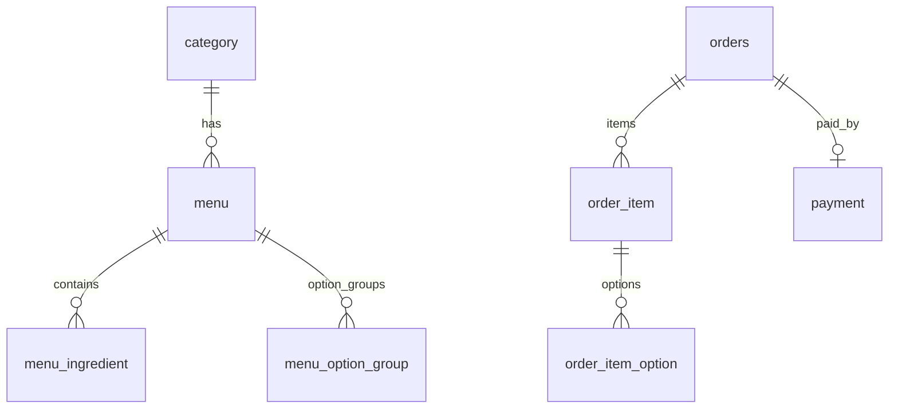

# ASAK DB 설계 테이블 정의서

> Notion 05. DB 설계 · MySQL 3NF 22테이블 · `asak-data/seed/manifest.json`

## ERD (요약)

## 시드 manifest 수치 (v2)

| 엔티티 | 건수 |
|--------|------|
| `category` | 6 |
| `code_group` | 10 |
| `common_code` | 32 |
| `tag` | 3 |
| `menu` | 84 |
| `menu_tag` | 21 |
| `menu_nutrition` | 84 |
| `ingredient` | 90 |
| `allergen` | 14 |
| `ingredient_allergen` | 108 |
| `menu_ingredient` | 578 |
| `option_group` | 7 |
| `menu_option_group` | 467 |
| `menu_option` | 9,166 |
| `option_item` | 157 |
| `option_item_component` | 0 |
| `payment_method_config` | 1 |

> 주문 5테이블(`orders`~`payment`)은 설계 포함·시드 미포함. API-005/006 구현 시 DDL 추가.

## 22테이블 정의 (22개)

| # | 테이블 | 설명 | 연계 REQ |
|---|--------|------|----------|
| 1 | `category` | 카테고리 마스터. 6개 분류 (seed: 6) | FWD-MENU-001 |
| 2 | `code_group` | 공통코드 그룹 (seed: 10) | KSD-ARCH-001 |
| 3 | `common_code` | 공통코드 상세 (seed: 32) | KSD-ARCH-001 |
| 4 | `tag` | 메뉴 태그 마스터 (seed: 3) | FWD-MENU-013 |
| 5 | `menu` | 판매 메뉴 마스터 (seed: 84) | FWD-MENU-001 |
| 6 | `menu_tag` | 메뉴-태그 N:M (seed: 21) | FWD-MENU-013 |
| 7 | `menu_nutrition` | 메뉴 영양정보 (seed: 84) | FWD-MENU-009 |
| 8 | `ingredient` | 재료 마스터 (seed: 90) | FWD-MENU-003 |
| 9 | `allergen` | 알레르기 14종 (seed: 14) | FWD-MENU-008 |
| 10 | `ingredient_allergen` | 재료-알레르기 N:M (seed: 108) | FWD-MENU-008 |
| 11 | `menu_ingredient` | 메뉴 기본 재료 (seed: 578) | FWD-MENU-003 |
| 12 | `option_group` | 옵션그룹 마스터 (seed: 7) | FWD-MENU-003 |
| 13 | `menu_option_group` | 메뉴-옵션그룹 (seed: 467) | FWD-MENU-003 |
| 14 | `menu_option` | 메뉴별 옵션 설정·추천 드레싱 (seed: 9166) | FWD-MENU-004 |
| 15 | `option_item` | 옵션 선택 항목 (seed: 157) | FWD-MENU-003 |
| 16 | `option_item_component` | 세트 옵션 구성품 (seed: 0) | LMIS-MENU-006 |
| 17 | `payment_method_config` | 결제수단 설정 (seed: 1) | FWD-PAY-001 |
| 18 | `orders` | 주문 헤더 (seed: —) | FWD-ORDER-001 |
| 19 | `order_item` | 주문 메뉴 단위 (seed: —) | LMIS-ORDER-004 |
| 20 | `order_item_option` | 선택 옵션 (seed: —) | LMIS-ORDER-004 |
| 21 | `item_exclusion` | 제외 재료 (seed: —) | FWD-MENU-007 |
| 22 | `payment` | 결제 내역 (seed: —) | FWD-PAY-001 |

## MVP 우선순위

**필수 17**: category~option_item + orders~payment

**확장 5**: tag, menu_tag, menu_nutrition, option_item_component, payment_method_config

상세 컬럼·제약조건은 Notion 05. DB 설계 및 DevCopilot ERD 참고.
