# ASAK 사용자 시나리오 명세

> Notion 03. 사용자 시나리오 · SC-001~018 (2026-07-05)

## 전체 주문 흐름

## 시나리오 목록 (18건)

### SC-001 신규 고객의 기본 주문 흐름 (FWD-UI-001)

- **시작**: ASAK 키오스크 화면 진입(처음 방문 고객)
- **종료**: 결제 완료 후 주문번호가 화면에 표시됨
- **기본 흐름**: 카테고리 탐색 → 메뉴 선택 → 베이스/드레싱/토핑 옵션 선택(추천조합 기본값) → 옵션 설명 확인 → 장바구니 담기 → 결제수단 선택 → 결제 → 주문번호 확인
- **예외**: 옵션이 헷갈려 이전 단계로 돌아가도 선택 내용이 유지됨 (사용자가 지적한 키오스크 취소 시 초기화 문제 개선)
- **상태**: 초안

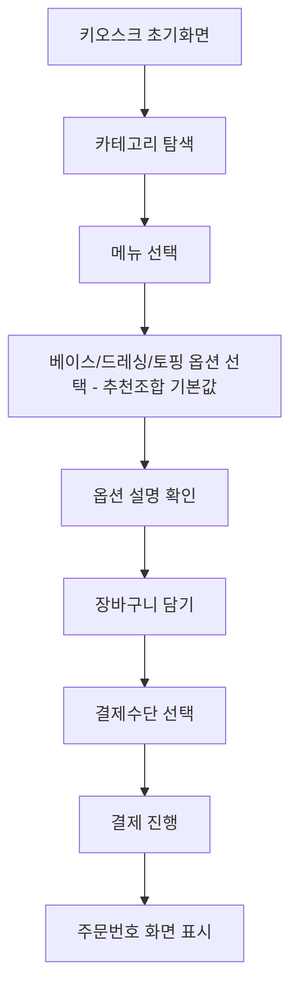

### SC-002 재방문 고객의 빠른 주문(속도 중심) (FWD-UI-001)

- **시작**: 재방문 고객이 키오스크 사용 시작
- **종료**: 결제 완료 및 주문번호 표시, 화면 전환 5회 이내 목표 (2026-07-05 수정: 4단계→5회, 주문확인 화면 반영)
- **기본 흐름**: 메뉴 선택 → 자주 베스트/이전 조합 바로 재사용(추천조합 기본값) → 장바구니 담기 → 결제수단 확인 후 결제 → 완료
- **예외**: 없음
- **상태**: 초안

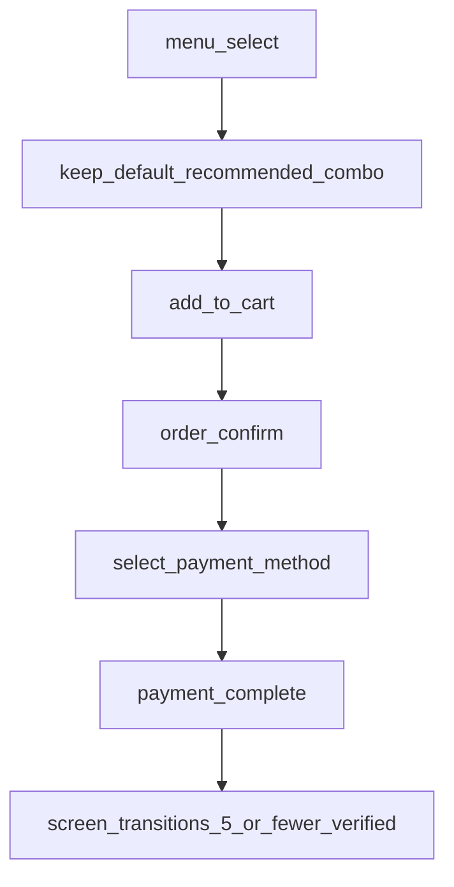

### SC-003 품절 판매 항목이 포함된 상황에서의 주문 (FWD-PAY-002)

- **시작**: 관리자가 특정 재료 또는 옵션 항목을 품절 처리한 상태
- **종료**: 고객이 품절되지 않은 항목으로 주문 진행
- **기본 흐름**: 품절된 판매 항목은 회색 처리된 채 SOLD OUT 표시됨 → 선택 불가 → 고객이 다른 항목으로 대체 선택
- **예외**: 핵심 재료 또는 베이스 재료가 품절된 경우 해당 메뉴 또는 관련 카테고리 메뉴가 품절 표시됨
- **상태**: 초안

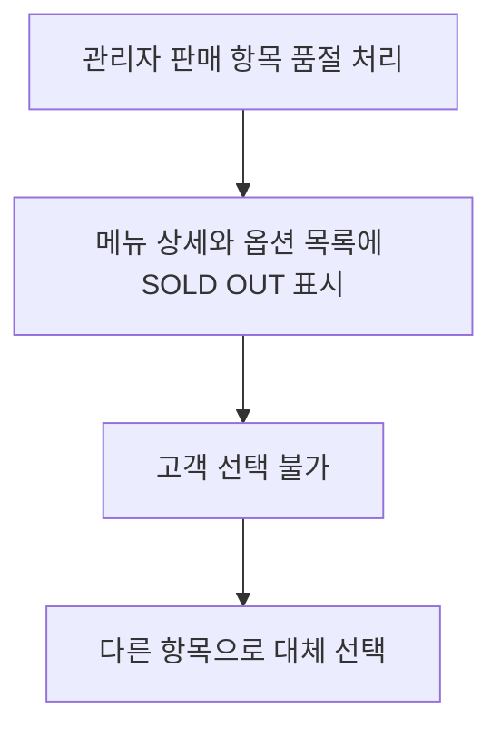

### SC-004 결제 성공 흐름(수단 노출 포함) (FWD-MENU-001)

- **시작**: 장바구니에 1개 이상 메뉴가 담겨있음
- **종료**: 결제 승인 완료 및 주문번호 표시
- **기본 흐름**: 장바구니에서 결제하기 → CARD 가상 결제수단 노출 → 결제 진행 → 승인 → 주문번호 생성
- **예외**: 없음(정상 흐름)
- **상태**: 초안

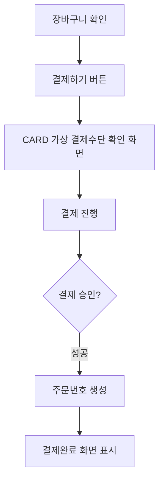

### SC-005 결제 실패 흐름 (FWD-PAY-002)

- **시작**: 결제 진행 중
- **종료**: 재시도 성공 또는 직원 호출 안내
- **기본 흐름**: 결제 진행 → 승인 실패 응답 수신(금액 불일치/주문 만료 등) → 실패 원인 화면 안내 → 결제 재시도 유도
- **예외**: 장바구니 내용은 유지되며 사용자가 다시 결제를 시도할 수 있음
- **상태**: 초안

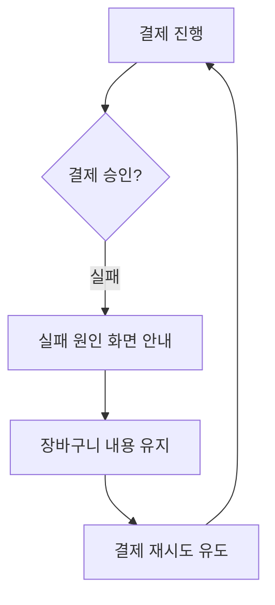

### SC-006 멤버십 스탬프 1회 확인 후 자동 적립 (LMIS-MENU-004)

- **시작**: 결제 단계 진입
- **종료**: 결제완료 화면에 적립 여부가 표시됨(결제 전/후 이중 확인 없음)
- **기본 흐름**: 결제 진행 중 멤버십 적립 여부 1회 확인 → 결제 완료 시 자동 적립 처리 → 결제완료 화면에 적립 결과 표시
- **예외**: 멤버십 미가입 고객은 적립 단계 생략하고 바로 결제 진행
- **상태**: 초안

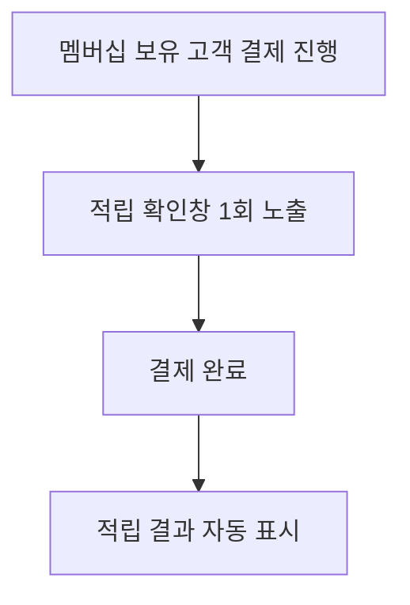

### SC-007 관리자의 판매 항목 품절 처리 (FWD-MENU-007)

- **시작**: 재료 또는 메뉴 구성 항목 소진으로 품절 발생
- **종료**: 키오스크 화면에 판매 항목 품절 상태가 반영됨
- **기본 흐름**: 관리자 품절 관리 화면 진입(Week 5 MVP에서는 인증 없이 바로 접근) → 품절 처리할 메뉴/재료 선택 → 품절 토글 ON → 관련 메뉴 목록/메뉴 상세/옵션 선택 화면에 즉시 반영
- **예외**: 같은 재료가 기본 구성과 추가 토핑에 모두 쓰이면 메뉴/상세/옵션 품절 상태에 함께 반영됨
- **상태**: 초안

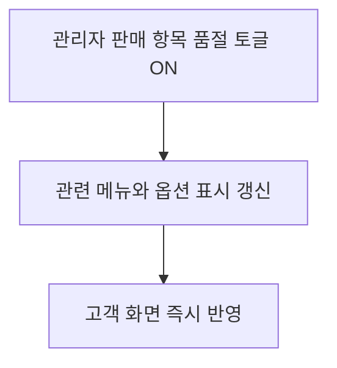

### SC-008 관리자의 주문 상태 관리 (LMIS-MENU-001)

- **시작**: 고객이 결제를 완료함
- **종료**: 주문 상태가 완료로 변경되고 관리자 화면에 반영됨
- **기본 흐름**: 주문 접수 → 관리자 주문 목록에 노출 → 주문 상세 확인 → 준비중으로 상태 변경 → 조리 완료 후 완료로 변경
- **예외**: 없음
- **상태**: 초안

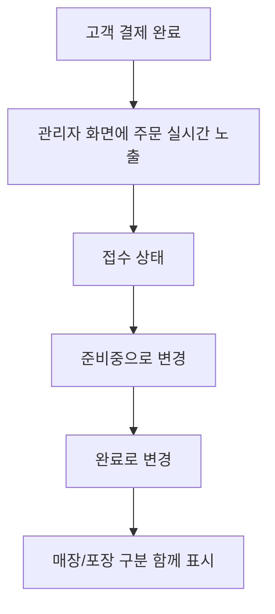

### SC-009 장바구니 수정(수량변경/삭제) (FWD-CART-002)

- **시작**: 장바구니에 1개 이상 메뉴가 담겨있음
- **종료**: 수정된 내용이 즉시 반영됨
- **기본 흐름**: 장바구니 진입 → 담은 항목 수량 -/+ 조정 → 특정 항목 삭제 → 총금액 자동 재계산
- **예외**: 마지막 1개 삭제 시 장바구니 빈 상태로 메뉴선택 화면으로 유도
- **상태**: 초안

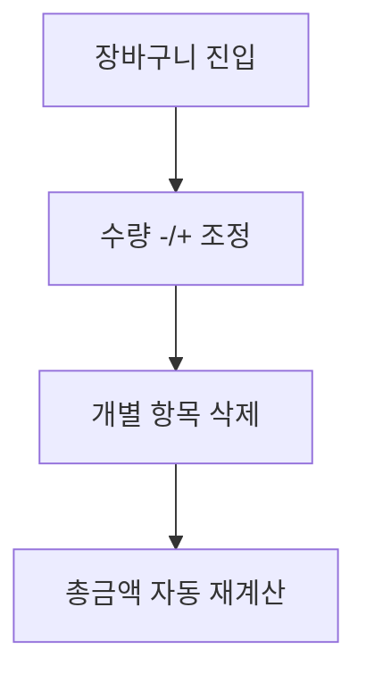

### SC-010 알레르기/비건 태그 확인 후 주문 (LMIS-MENU-001)

- **시작**: 견과류 알레르기가 있는 고객이 메뉴 탐색 중
- **종료**: 고객이 안전하게 메뉴를 선택하거나 회피함
- **기본 흐름**: 알레르기/비건 태그 확인 → 해당 재료 포함 여부 인지 → 태그 기준으로 메뉴 선택/회피
- **예외**: 태그 미표시 재료가 있을 경우 고객이 직접 문의하도록 안내 문구 필요
- **상태**: 초안

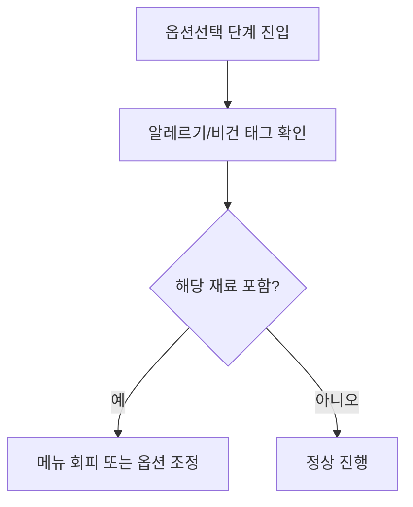

### SC-011 재료 제외(-) 옵션으로 커스텀 주문 (FWD-CART-001)

- **시작**: 특정 재료를 못 먹는 고객이 옵션선택 단계 진입
- **종료**: 장바구니/주문서에 제외 재료가 명시됨
- **기본 흐름**: 기본 포함 재료 중 특정 항목 "빼기" 선택 → 가격 변동 없이 장바구니에 반영 → 주문서에 제외 항목 표시
- **예외**: 없음(가격 차감 로직 없음을 명확히 확인, 선생님 피드백 6번 반영)
- **상태**: 초안

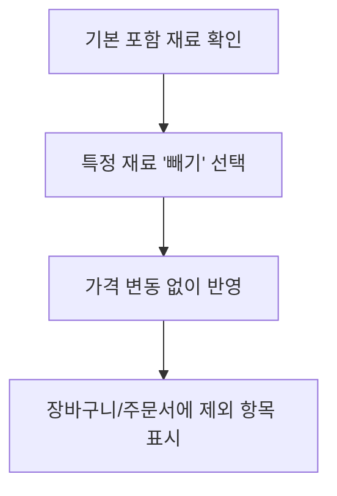

### SC-012 일정시간 미입력 시 자동 초기화 (LMIS-ORDER-003)

- **시작**: 주문 진행 중 고객이 자리를 비움
- **종료**: 초기화면으로 전환되고 다음 고객이 깨끗한 상태로 이용 가능
- **기본 흐름**: 고객이 주문 진행 중 자리를 뜨 → 일정시간(예 30초) 동안 입력 없음 → 경고 없이 초기화면으로 자동 복귀 → 장바구니 초기화
- **예외**: 타임아웃 직전 다시 터치하면 타이머 리셋(앞팀 사례 참고)
- **상태**: 초안

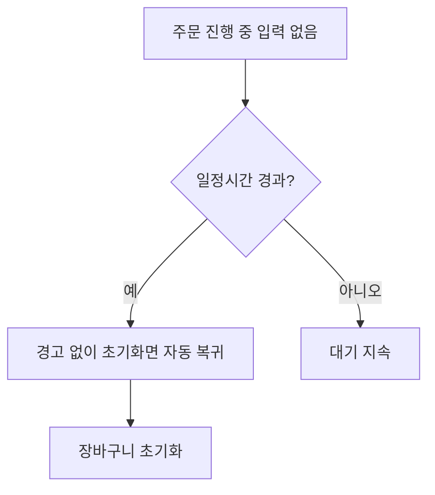

### SC-013 접근성 옵션으로 저시력 고객 주문 (FWD-SYS-001)

- **시작**: 저시력 고객이 키오스크 이용 시작
- **종료**: 안내 없이 주문 완료(성공기준 첫방문고객 기준과 동일)
- **기본 흐름**: 저시력 고객이 초기화면 진입 → 글자크기 확대 옵션 인지 → 큰 글자/높은 대비로 메뉴 탐색 → 주문 완료
- **예외**: 없음
- **상태**: 초안

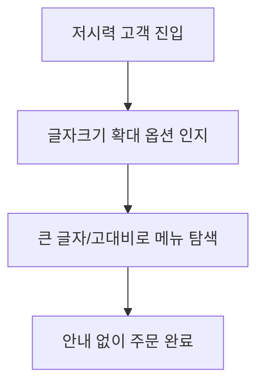

### SC-014 매장/포장 여부 선택 (FWD-ORDER-001)

- **시작**: 홈 화면에서 주문시작 버튼 클릭
- **종료**: 주문에 orderType(EAT_IN/TAKE_OUT) 구분값이 저장되어 장바구니로 이동
- **기본 흐름**: 홈 화면에서 주문시작 클릭 → 먹고가기/포장 선택 → 선택값(orderType)을 장바구니와 주문확인 단계까지 유지 → 주문 생성 시 orderType에 반영
- **예외**: 선택 없이 다음 단계로 진행 불가(필수 선택)
- **상태**: 초안

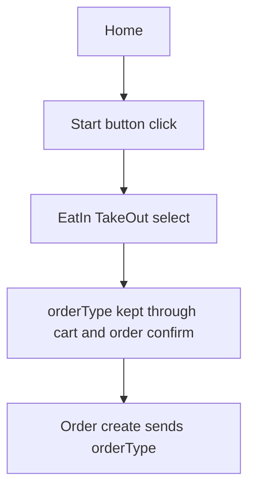

### SC-015 영수증 출력 여부 선택 (RTOS-DEVICE-001)

- **시작**: 결제 승인 완료 직후
- **종료**: 영수증 출력 완료 또는 화면 주문번호 표시
- **기본 흐름**: 결제 완료 화면에서 영수증 출력 여부 선택 → 출력 선택 시 모의 프린터 요청 → 미선택 시 화면 주문번호로 대체
- **예외**: 프린터 오류 시 화면 주문번호로 자동 대체
- **상태**: 초안

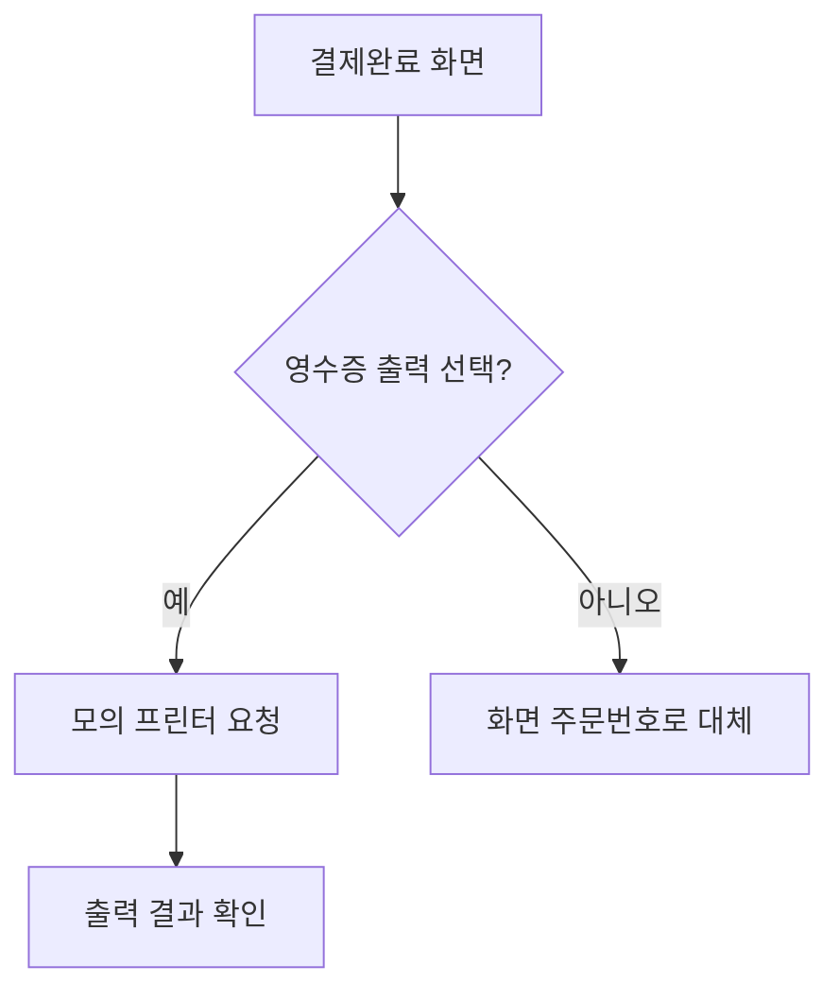

### SC-016 QR/바코드로 쿠폰 인식 후 결제 (LMIS-ORDER-005)

- **시작**: 고객이 모바일 쿠폰을 보유하고 있음
- **종료**: 할인 적용된 금액으로 결제 완료
- **기본 흐름**: 결제 단계 진입 → 모바일 쿠폰/멤버십 바코드 스캔 → 할인 자동 적용 → 잔액 결제 진행
- **예외**: 스캔 실패/만료된 쿠폰 시 오류 메시지 안내 후 일반결제로 진행
- **상태**: 초안

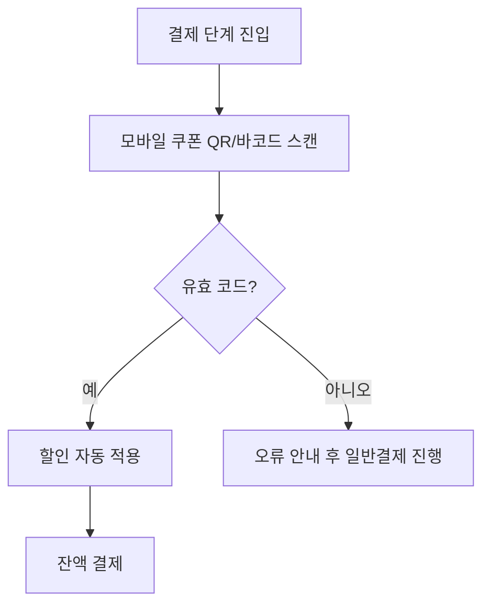

### SC-017 관리자의 신규 메뉴 등록 (FWD-PAY-001)

- **시작**: 관리자가 신규 메뉴를 추가하려는 상황
- **종료**: 신규 메뉴가 키오스크 메뉴선택 화면에 즉시 노출
- **기본 흐름**: 관리자 로그인 → 신규 메뉴 등록(이름/가격/이미지/카테고리) → 옵션그룹 연결 → 저장
- **예외**: 필수값 누락 시 저장 불가 안내
- **상태**: 초안

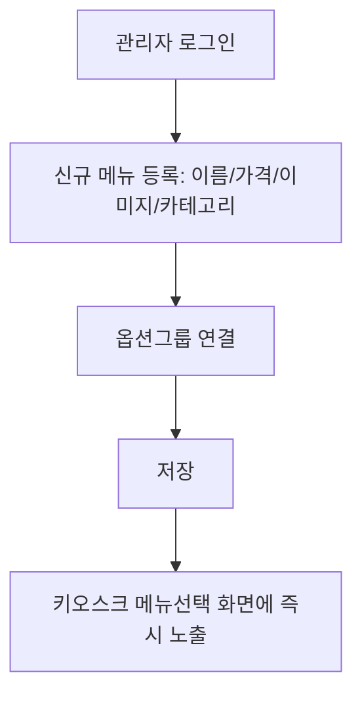

### SC-018 관리자의 일별 매출 조회 (FWD-UI-001)

- **시작**: 관리자가 매출 현황을 확인하려는 상황
- **종료**: 기간별 매출/판매량이 화면에 표시됨
- **기본 흐름**: 관리자 로그인 → 기간 선택 → 일별 매출/메뉴별 판매량 조회
- **예외**: 해당 기간에 데이터가 없을 경우 공백 상태 안내
- **상태**: 초안

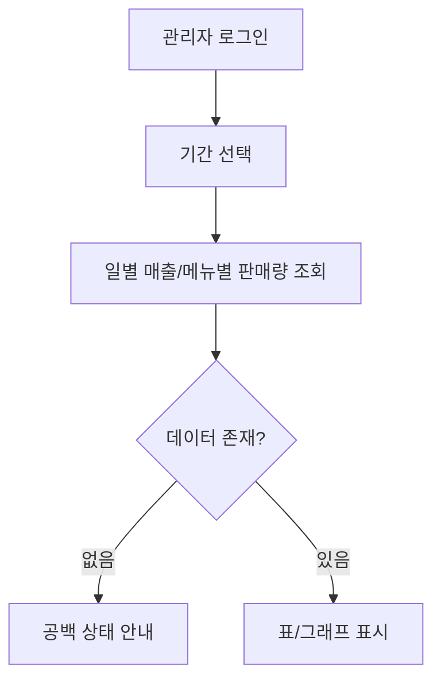
