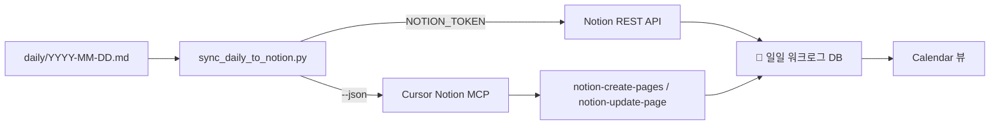

# MCP 워크플로 — 일일 워크로그 → Notion

Git `worklog/daily/` 정본을 Cursor + Notion MCP로 Notion DB에 반영하는 절차입니다.

| 리소스 | URL / 경로 |
|---|---|
| Daily DB | https://app.notion.com/p/eeae4beb07ad4051928a87de0ea4c8f9 |
| data_source_id | `3a3a1b40-6deb-441a-971f-70199294445a` ( `notion_config.json` ) |
| sync 스크립트 | `worklog/scripts/sync_daily_to_notion.py` |
| 팀 가이드 | `worklog/guide-team-daily.md` · Notion [📅 일일 워크로그 — 팀 가이드](https://app.notion.com/p/39451ef04f0b81c0a018e8fe6ea9fb95) |

---

## 흐름 개요



---

## 경로 A — REST API (권장, 로컬·CI)

1. `NOTION_TOKEN` 설정 + DB에 Integration 연결
2. daily md 작성
3. 실행:

```powershell
python worklog/scripts/sync_daily_to_notion.py --date today
```

- 같은 **날짜 + 담당** 조합이 있으면 **update** (idempotent)
- 없으면 **create**

---

## 경로 B — Cursor Notion MCP (토큰 없을 때)

### 1. daily 파싱 → JSON

```powershell
python worklog/scripts/sync_daily_to_notion.py --date today --json
```

출력 예시 구조:

```json
{
  "database_id": "eeae4beb07ad4051928a87de0ea4c8f9",
  "data_source_id": "3a3a1b40-6deb-441a-971f-70199294445a",
  "rows": [
    {
      "제목": "2026-07-05 이하진 일일",
      "date:날짜:start": "2026-07-05",
      "date:날짜:is_datetime": 0,
      "담당": "이하진",
      "WBS": "WBS-015",
      "요약": "주문 API (ASAK-back) #42",
      "Git daily": "https://github.com/hagenie128/ASAK/blob/main/worklog/daily/2026-07-05.md",
      "블로커": "__NO__"
    }
  ]
}
```

### 2. 기존 행 조회 (MCP)

- `notion-fetch` 로 DB 스키마 확인
- `notion-query-database-view` 또는 fetch로 **날짜 + 담당** 기존 페이지 ID 확인

### 3. upsert (MCP)

**신규** — `notion-create-pages`:

```json
{
  "parent": { "type": "data_source_id", "data_source_id": "3a3a1b40-6deb-441a-971f-70199294445a" },
  "pages": [{
    "properties": {
      "제목": "2026-07-05 이하진 일일",
      "date:날짜:start": "2026-07-05",
      "date:날짜:is_datetime": 0,
      "담당": "이하진",
      "WBS": "WBS-015",
      "요약": "주문 API (ASAK-back) #42",
      "Git daily": "https://github.com/hagenie128/ASAK/blob/main/worklog/daily/2026-07-05.md",
      "블로커": "__NO__"
    }
  }]
}
```

**갱신** — `notion-update-page` (`command: update_properties`, `page_id` 지정)

### 4. Cursor 프롬프트 예시

```text
worklog/scripts/sync_daily_to_notion.py --date today --json 출력을 읽고,
Notion MCP로 📅 일일 워크로그 DB에 upsert 해줘.
같은 날짜+담당이 있으면 update, 없으면 create.
완료 후 Calendar 뷰 링크 알려줘.
```

프롬프트 템플릿: [`worklog/prompts/prompt-daily-sync.md`](prompts/prompt-daily-sync.md)

---

## DB 스키마 (요약)

| 속성 | 타입 | 비고 |
|---|---|---|
| 제목 | title | `{날짜} {담당} 일일` |
| 날짜 | date | Calendar 뷰 키 |
| 담당 | select | 이하진, 김나연, 박유진, 미지정 |
| WBS | text | |
| 요약 | text | 작업 한 줄 |
| Git daily | url | GitHub daily md 링크 |
| 블로커 | checkbox | |

---

## Calendar 뷰

- DB 내 뷰 이름: **캘린더** (`calendarBy`: 날짜)
- 팀원은 [guide-team-daily.md](guide-team-daily.md) Quick Start 후 이 뷰에서 확인
- **마일스톤**: `2026-09-02` — 🎯 최종 발표 (DB에 고정 행)

---

## 관련 파일

| 파일 | 역할 |
|---|---|
| `worklog/scripts/init_daily.py` | 당일 md 자동 생성 |
| `worklog/scripts/sync_today.ps1` | Windows sync 래퍼 |
| `worklog/notion_config.json` | DB ID, Git daily base URL |
| `worklog/templates/template-daily-auto.md` | 자동 생성 템플릿 (기본) |
| `worklog/templates/template-daily-manual.md` | 수동 복사 템플릿 |
